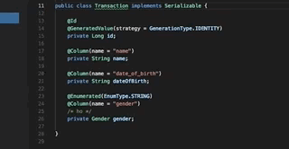

# java-code-generators README
Generate Setters & Getters for Java Class's
Generate toString()

## Usage

## Requirements
none

## Release Notes

## [2.1.0] - 2018-07-24
### Added
- generate Constructor
- generate Constructor Using Fields

## [2.0.1] - 2018-07-24
### Fixed
- declarations with assignment

-----------------------------------------------------------------------------------------------------------

**Enjoy!**
