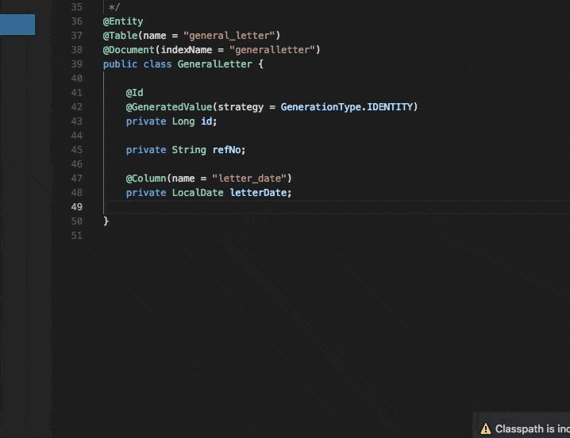

# Java Code Generators

## Features

- Generate Setters & Getters
- Generate toString()
- Generate Constructor
- Generate Constructor Using Fields
- Generate Equals And HashCode

## Usage

## Requirements

none

## Release Notes

## [3.0.0] - 2018-08-04

### Added

- generate Equals And HashCode

## [2.1.0] - 2018-07-24

### Added

- generate Constructor
- generate Constructor Using Fields

-----------------------------------------------------------------------------------------------------------

**Enjoy!**
