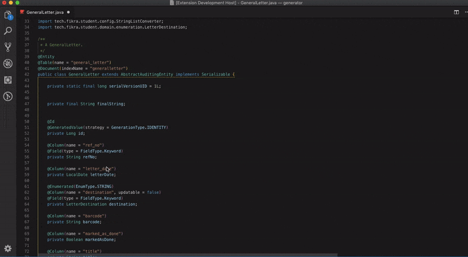

# Java Code Generators

## Features

-   Generator GUI
-   Generate Setters & Getters
-   Generate toString()
-   Generate Constructor
-   Generate Constructor Using Fields
-   Generate Equals And HashCode
-   Generate Fluent Setters

## Usage

## Requirements

none

## Release Notes

## [4.2.0] - 2019-04-22

### Added

-   Settings property to use id only with `hashCode()` and `equals()`
-   Settings property to use String, Primitive and Primitive Wrappers only for `toString()`

## [4.1.0] - 2019-02-11

### Added

-   Support for multiple variables same line `private String firstName,lastName;`

## [4.0.0] - 2018-12-12

### Added

-   Generator GUI
-   Generate all "Quick"
-   toString() without Getters()
-   No need to highlight properties
-   Determine existing code "prevents duplicate"

**Enjoy!**
